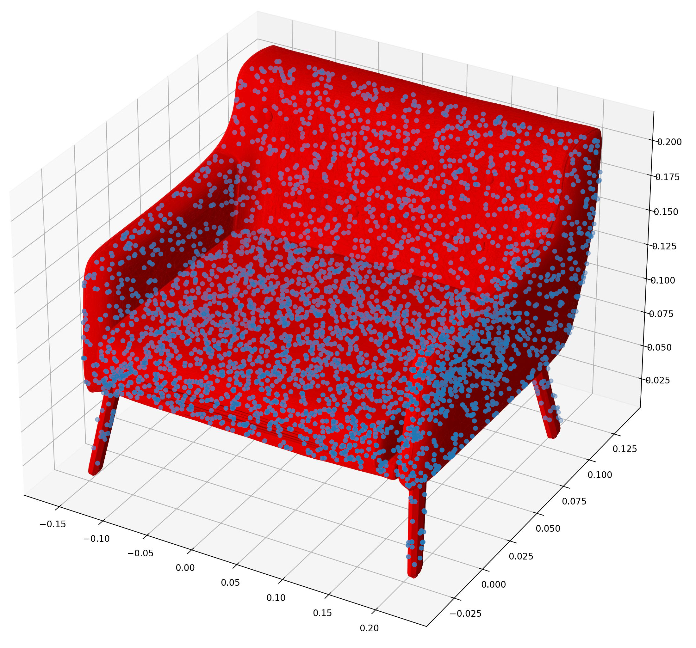

# Deep Learning
Final project for the Computational Intelligence and Deep Learning course at University of Pisa.

# Ensemble of RGB Images and 3D PointClouds Classification
As stated in the introductory chapter, the aim of the project was combining two different types of raw data:
 - RGB Images;
 - 3D Point clouds.

Ideally we would like to have such input raw data from two different sensors (i.e. camera and LiDAR). In this case, using data from our dataset:

    
    

    

# 3D PointClouds Classification using PointNet
PointNet is a simple and effective Neural Network for point cloud classification. PointNet takes raw point cloud data as input, which is typically collected from either a LiDAR or radar sensor. Unlike 2D pixel arrays (images) or 3D voxel arrays, point clouds have an unstructured representation in that the data is simply a collection (more specifically, a set) of the points captured during a LiDAR or radar sensor scan. In order to leverage existing techniques built around (2D and 3D) convolutions, many researchers and prac- titioners often discretize a point cloud by taking multi-view projections onto 2D space or quantizing it to 3D voxels. Given that the original data is manipulated, either approach can have negative impacts.

    

The architecture is surprisingly simple and quite intuitive. There are many ways of explaining it. One way is taking into account the transformations performed from the input space to the features space by projecting the points into a higher dimensional space. The classification network uses a shared multi-layer perceptron (MLP) to map each of the n points from three dimensions (x, y, z) to 64 dimensions. It is important to note that a single multi-layer perceptron is shared for each of the n points (i.e., mapping is identical and independent on the n points). This procedure is repeated to map the n points from 64 dimensions to 1024 dimensions. With the points in a higher-dimensional embedding space, max pooling is used to create a global feature vector in R1024. Finally, 52 a three-layer fully-connected network is used to map the global feature vector to k output classification scores.

    

# RGB Images Classification using VGG16
VGG16 is a convolution neural net (CNN) architecture which was used to win ILSVR (Imagenet) competition in 2014.

    

